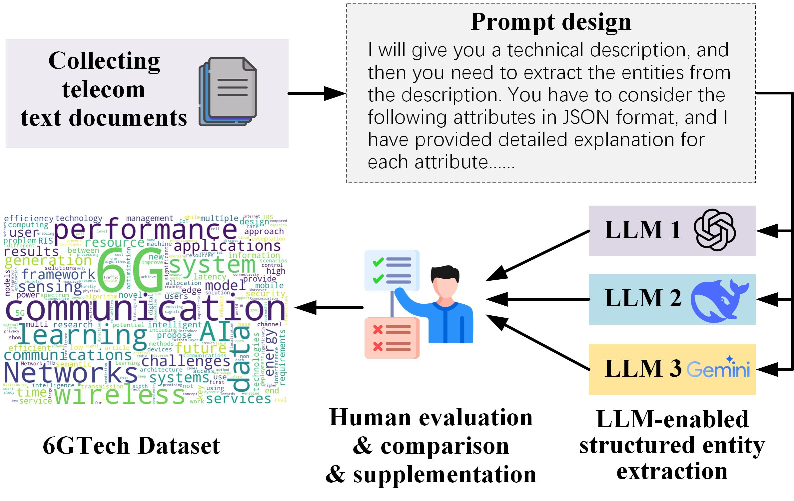

# 6GTech
This repo includes the 6GTech dataset


This repo includes the 6GTech dataset, which is initially designed for entity extraction tasks in the 6G domain. 

6GTech dataset includes 2390 sentences and 23747 words from more than 100 6G-related technical publications.
Based on paper abstract, the dataset provides entities extracted from the description:
For instance

```json
{
    "title": "Federated Learning for 6G Communications: Challenges, Methods, and Future Directions",
    "description": "As the 5G communication networks are being widely deployed worldwide, both industry and academia have started to move beyond 5G and explore 6G communications. It is generally believed that 6G will be established on ubiquitous Artificial Intelligence (AI) to achieve data-driven Machine Learning (ML) solutions in heterogeneous and massive-scale networks. However, traditional ML techniques require centralized data collection and processing by a central server, which is becoming a bottleneck of large-scale implementation in daily life due to significantly increasing privacy concerns. Federated learning, as an emerging distributed AI approach with privacy preservation nature, is particularly attractive for various wireless applications, especially being treated as one of the vital solutions to achieve ubiquitous AI in 6G. In this article, we first introduce the integration of 6G and federated learning and provide potential federated learning applications for 6G. We then describe key technical challenges, the corresponding federated learning methods, and open problems for future research on federated learning in the context of 6G communications.",
    "entities": {
      "0": {
        "entity name": "Federated learning",
        "Type": "6G-related technique",
        "Functions": "distributed AI approach with privacy preservation nature",
        "Benefits": "privacy preservation, vital solution to achieve ubiquitous AI in 6G",
        "Application and deployment scenarios": "various wireless applications",
        "Associated technologies": "Artificial Intelligence (AI), Machine Learning (ML)"} 
      }
  }
```

The following figure shows the main procedures of creating the dataset:




